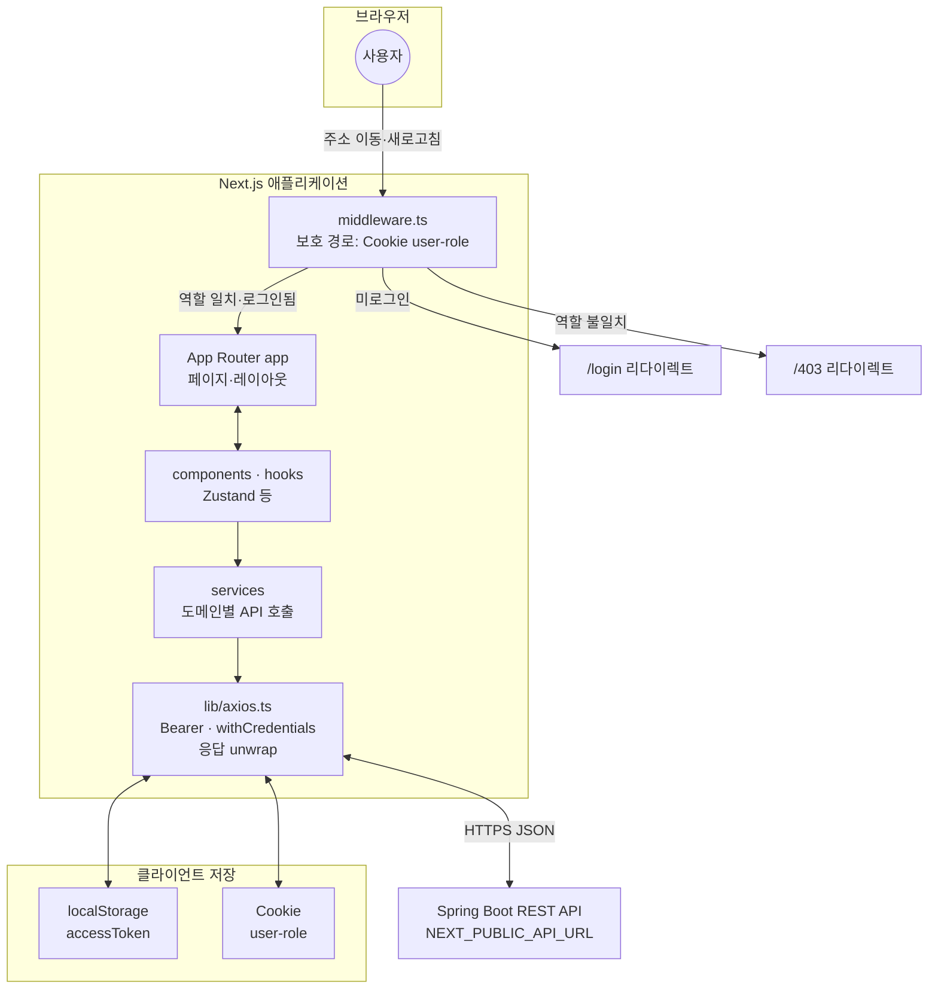

# Medical Service Frontend

의료 EMR 서비스 **웹 클라이언트**입니다. Spring Boot 백엔드 API와 연동하며, **환자·의사·간호사** 역할별 화면을 제공합니다.

---

## 기술 스택

| 구분 | 사용 |
| --- | --- |
| 프레임워크 | [Next.js](https://nextjs.org/) **16** (App Router) |
| UI | [React](https://react.dev/) **19**, TypeScript **5.7** |
| 스타일 | [Tailwind CSS](https://tailwindcss.com/) **4** |
| 컴포넌트 | [Radix UI](https://www.radix-ui.com/), [shadcn/ui](https://ui.shadcn.com/) 스타일 패턴 (`components/ui`) |
| 폼·검증 | [react-hook-form](https://react-hook-form.com/), [Zod](https://zod.dev/), [@hookform/resolvers](https://github.com/react-hook-form/resolvers) |
| HTTP | [Axios](https://axios-http.com/) (`lib/axios.ts` — 공통 인스턴스, JWT 헤더) |
| 상태 | [Zustand](https://zustand-demo.pmnd.rs/) (인증 등) |
| 차트·기타 | [Recharts](https://recharts.org/), [date-fns](https://date-fns.org/), [lucide-react](https://lucide.dev/) 아이콘 |
| 테마 | [next-themes](https://github.com/pacocoursey/next-themes) |
| 빌드 출력 | `next.config.mjs`에서 **`output: "standalone"`** — Docker 멀티스테이지 빌드에 사용 |

런타임은 **Node.js 20** 기준입니다 (Dockerfile·GitHub Actions와 동일).

---

## 아키텍처와 전체 흐름

아래는 **브라우저에서 Next.js가 백엔드 API까지 이어지는 구조**를 한 장으로 정리한 것입니다.



### 전체가 흘러가는 순서

1. **진입**  
   사용자가 URL로 접속하면 Next.js가 해당 경로의 **App Router** 페이지를 준비합니다. `/doctor`, `/nurse`, `/patient`(및 하위 경로), `/login`, `/register`에 대해서는 먼저 **`middleware.ts`** 가 실행됩니다.

2. **경로 보호**  
   미들웨어는 **Cookie `user-role`** 이 없으면 `/login`으로, 역할과 경로가 맞지 않으면 `/403`으로 보냅니다. 이미 로그인된 상태에서 `/login`·`/register`에 들어오면 역할에 맞는 홈(`/doctor` 등)으로 돌려보냅니다.

3. **화면 구성**  
   통과한 요청은 **`app/`** 아래 레이아웃·페이지가 렌더링되고, 실제 UI·상호작용은 **`components/`**, **`hooks/`**(예: 인증 스토어, 토스트)가 담당합니다.

4. **백엔드와 통신**  
   API가 필요하면 **`services/*.ts`** 가 **`lib/axios.ts`** 로 요청을 보냅니다.  
   - **베이스 URL**: 빌드 시 고정된 `NEXT_PUBLIC_API_URL`  
   - **인증**: 브라우저 **`localStorage`의 `accessToken`** 을 `Authorization: Bearer` 로 붙임  
   - **쿠키**: `withCredentials: true` 로 백엔드와 쿠키·CORS 설정이 맞을 때 같이 전송  
   - **응답**: `{ success, data }` 형태면 인터셉터에서 **`data`만** 꺼내 후속 코드에 넘김

5. **로그인 이후**  
   로그인·회원가입 성공 시 백엔드 응답에 맞춰 토큰·역할을 저장하고(예: `localStorage`, `user-role` 쿠키), 의사·간호사·환자 각각의 대시보드 경로로 이동합니다. 이후 같은 브라우저 세션에서는 위 2~4단계가 반복됩니다.

6. **배포 형태**  
   프로덕션은 **`output: "standalone"`** 빌드 결과를 Docker 등으로 올려 **Node가 `server.js`로 HTTP 서빙**하고, 사용자는 보통 그 앞단 **리버스 프록시·ALB**를 통해 접속합니다. API 서버는 **별도 호스트**(같은 도메인의 `/api` 프록시 또는 다른 ALB)일 수 있으며, 그때도 브라우저 입장에서는 `NEXT_PUBLIC_API_URL` 로만 구분됩니다.

---

## 사전 요구 사항

- **Node.js 20** 이상 권장  
- 백엔드(`medical-service-backend`)가 API를 제공하는 주소·포트에 맞춰 **`NEXT_PUBLIC_API_URL`** 을 설정합니다.  
  백엔드 기본 포트가 `3000`이면 예: `http://localhost:3000` (미설정 시 `lib/axios.ts`에서 동일 기본값 사용).

---

## 환경 변수

| 변수 | 설명 |
| --- | --- |
| `NEXT_PUBLIC_API_URL` | 백엔드 API 베이스 URL (끝 `/` 없이). **빌드 시점**에 번들에 포함되므로, Docker·CI에서는 `--build-arg` 또는 `env`로 반드시 맞춥니다. |

쿠키 기반 보조 값(`user-role` 등)은 로그인 흐름에서 설정됩니다. 백엔드 CORS·세션/쿠키 설정과 짝을 맞춰야 합니다.

---

## 스크립트

```bash
npm ci          # 의존성 설치 (CI와 동일)
npm run dev     # 개발 서버 (기본 포트 8080, webpack)
npm run build   # 프로덕션 빌드
npm run start   # 프로덕션 서버 (포트 8080)
npm run lint    # ESLint
```

타입 검사만 하려면: `npx tsc --noEmit` (CI에서 사용).

---

## 프로젝트 구조 (요약)

```text
medical-service-frontend/
├── .github/
│   └── workflows/          # GitHub Actions (타입체크·빌드·Docker 스모크 등)
├── app/                    # App Router 페이지 (/login, /doctor, /nurse, /patient 등)
├── components/             # 화면별·공유 컴포넌트 (doctor/, nurse/, patient/, ui/)
├── services/               # API 호출 모듈 (auth, patient, prescription 등)
├── hooks/                  # 커스텀 훅 (인증 스토어, 토스트 등)
├── lib/                    # axios 인스턴스, 유틸
├── types/                  # 공통 타입
├── middleware.ts           # 역할별 경로 보호 (/doctor, /nurse, /patient)
├── next.config.mjs         # standalone, 이미지 설정 등
└── Dockerfile              # standalone 산출물 기반 컨테이너 (포트 80)
```

---

## 인증·라우팅

- **`middleware.ts`**: `/doctor`, `/nurse`, `/patient` 접근 시 쿠키 `user-role`과 일치하는지 검사. 불일치 시 `/403`, 미로그인 시 `/login`.
- **API 호출**: `lib/axios.ts`에서 `localStorage`의 `accessToken`을 `Authorization: Bearer`로 붙입니다. 백엔드 JWT 설정과 맞춥니다.

---

## Docker

빌드 시 API 주소를 넘기려면:

```bash
docker build --build-arg NEXT_PUBLIC_API_URL=https://your-api.example.com -t medical-frontend:local .
```

컨테이너는 **포트 80**에서 `node server.js`(standalone)로 기동합니다. 운영 배포 흐름은 인프라 레포의 `medical-service-infra` 문서를 참고합니다.

---

## CI

- **`.github/workflows/medical-services-ci.yml`**: `npm ci` → `tsc --noEmit` → `next build` → Docker 스모크 빌드(`push: false`).  
- `main` / `master` 등 조건에 따라 GHCR 푸시 job이 붙어 있을 수 있으니 워크플로의 `if:` 를 확인합니다.

---

## 관련 저장소·문서

- 백엔드: `medical-service-backend`  
- 인프라·배포: `medical-service-infra` (`md/README.md`, `md/infra.md`)  
- 프론트·백 연동 이슈 정리(모노레포 루트): `mini_project_3/md/프론트엔드_백엔드_연동_이슈와_해결.md`
